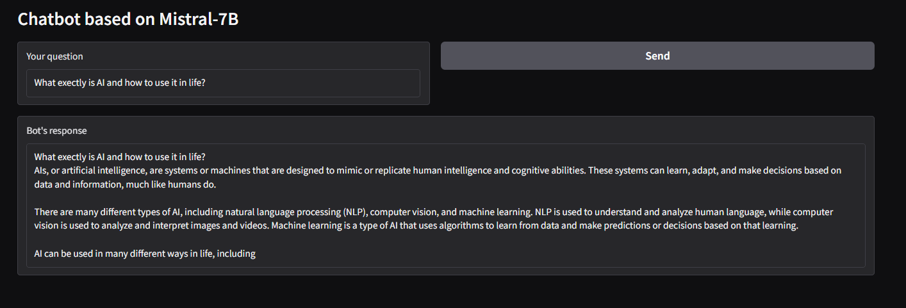

# **_Chatbot with Mistral-7B / Llama2-7B Models_**

## About
This project demonstrates a chatbot powered by two state-of-the-art large language models: **Mistral-7B** / **Llama2-7B**. Both models are optimized for generating human-like responses and can be deployed locally or in the cloud. 

The chatbot is built using the **Hugging Face Transformers** library, **Gradio** for the web interface, and **bitsandbytes** for 8-bit quantization to reduce memory usage. This project showcases how to load pre-trained models, generate responses, and create a user-friendly interface for interaction.

### Key Features
* **Models**: 
  - **Mistral-7B**: A modern language model with 7 billion parameters, optimized for instruction-following tasks.
  - **Llama2-7B**: A powerful open-source model from Meta, designed for conversational AI.
* **Quantization**: Support for 8-bit quantization to reduce GPU memory requirements.
* **Offline Mode**: Ability to run the chatbot offline by downloading model files locally.
* **Online Mode**: Option to load models directly from Hugging Face Hub (requires internet access and authentication).
* **Web Interface**: A simple and intuitive Gradio-based UI for seamless user interaction.
* **Optimized Performance**: Configurations for both GPU (CUDA) and CPU environments.

> Version: Apr 2025, created by Gleb 'Faitsuma' Kiryakov

---


## Project Structure

### Code Overview
1. **Model Loading**:
   * The project supports two models: **Mistral-7B** and **Llama2-7B**.
   * Models can be loaded either from the Hugging Face Hub (online mode) or from local files (offline mode).
   * The code dynamically detects whether a GPU is available and adjusts the device (`cuda` or `cpu`) accordingly.

2. **Tokenization**:
   * The tokenizer processes user input into tokens that the model can understand.
   * Special tokens (e.g., `<bos>`, `<eos>`) are handled automatically.

3. **Response Generation**:
   * The model generates responses using advanced techniques like temperature scaling, top-p sampling, and max token length control.
   * Responses are decoded back into human-readable text.

4. **Web Interface**:
   * A Gradio-based web interface allows users to interact with the chatbot via a browser.
   * The interface includes a text input box for user queries and a text output box for bot responses.

5. **Device Management**:
   * For GPU setups, 8-bit quantization is supported to reduce memory usage.
   * For CPU-only setups, 8-bit quantization is disabled, and the model runs in full precision.

---

## How to Use

### Prerequisites
* Install the required dependencies:
```
    pip install torch transformers gradio bitsandbytes
```

---

### Running the Code

#### Online Mode
1. Clone this repository:
```
    git clone https://github.com/your-repo/chatbot-mistral-llama
    cd chatbot-mistral-llama
```

2. Run the script:
```
    python chatbot.py
```

3. Access the Web Interface:
   * Open your browser and navigate to `http://localhost:7860`.
   * Enter your query in the input box and click "Send" to get a response.

#### Offline Mode
1. Download the model files:
   - **Mistral-7B**: Visit the [Mistral-7B-Instruct-v0.1](https://huggingface.co/mistralai/Mistral-7B-Instruct-v0.1) page on Hugging Face.
     - Download the following files:
       - `config.json`
       - `pytorch_model.bin` (or `model.safetensors`)
       - `tokenizer.model`
       - `tokenizer_config.json`
       - `special_tokens_map.json`
   - **Llama2-7B**: Visit the [Llama2-7B](https://huggingface.co/meta-llama/Llama-2-7b-chat-hf) page on Hugging Face.
     - Download the same set of files as above.

2. Place the downloaded files in separate folders, e.g.:
   - `/path/to/local/mistral-model`
   - `/path/to/local/llama-model`

3. Update the script to point to the local paths:
    model_path = "/path/to/local/mistral-model"  # or "/path/to/local/llama-model"

4. Run the script:
```
    python main.py
```

5. Access the Web Interface:
   * Open your browser and navigate to `http://localhost:7860`.

---


## Preshow

<div align="center">
    
</div>

---
